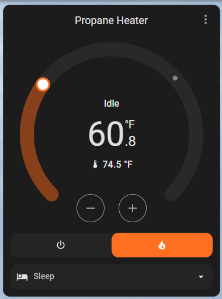
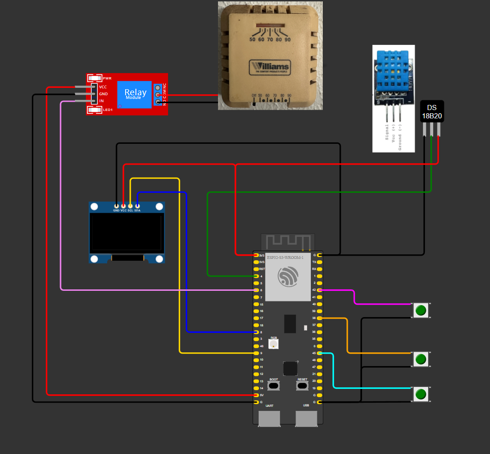
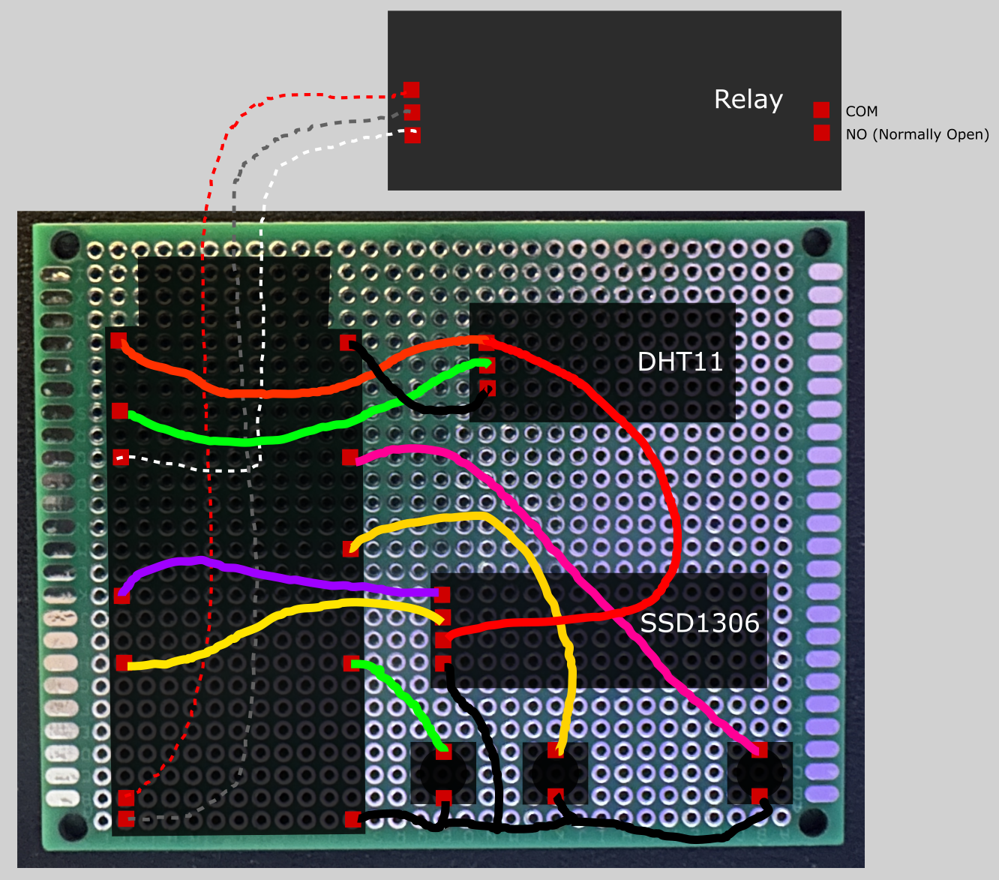
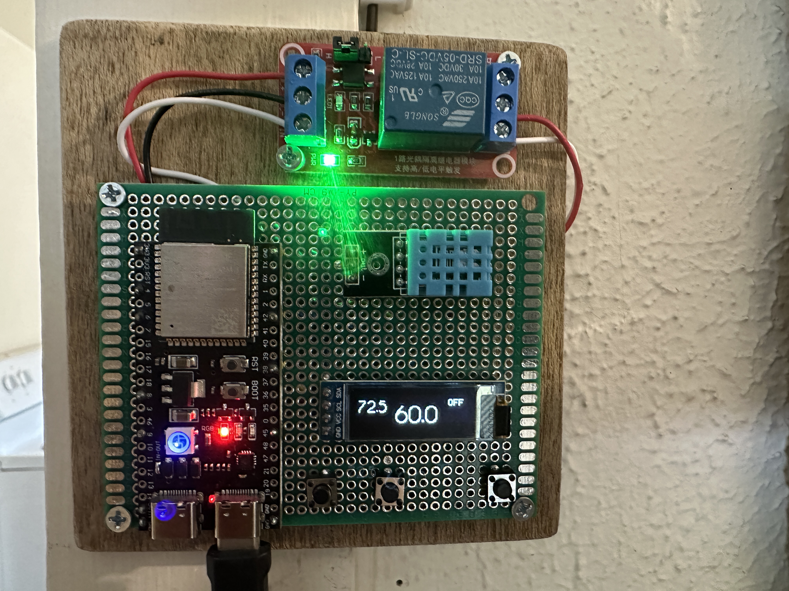

# Two-wire Heat-only Smart Thermostat with ESP32 S3

## Introduction

This project aims to replace an old, two-wire heat-only thermostat with a modern smart thermostat using an ESP32. The smart thermostat will feature a user interface on an OLED display, temperature control through physical buttons, and integration with Home Assistant for smart home automation.

## Materials Used

To build this smart thermostat, you will need the following components:

* **[ESP32 S3 DevKitC-1](https://docs.espressif.com/projects/esp-idf/en/stable/esp32s3/hw-reference/esp32s3/user-guide-devkitc-1-v1.0.html)**: The main microcontroller for the project.
* **I2C SSD1306 OLED Display (128x32)**: For displaying temperature and system status. 
* **5V Relay**: To control the heater.
* **DHT11 Temperature and Humidity Sensor**: For measuring the ambient temperature.
* **3 Push Buttons**: For controlling the heater (on/off) and adjusting the target temperature.

## Wiring Diagram

Below is the wiring diagram for connecting the components:

* **ESP32 S3 Devkit**
    * **5V** to **5V Relay VCC**
    * **GND** to **5V Relay GND**
    * **GPIO 6** to **Relay IN** (Control signal)
    * **GPIO 4** to **DHT11 Data Pin**
    * **GPIO 42** to **Button 1 (On/Off)**
    * **GPIO 38** to **Button 2 (Temp Up)**
    * **GPIO 45** to **Button 3 (Temp Down)**
    * **SSD1306 SCL** to **ESP32 GPIO 9** (SCL)
    * **SSD1306 SDA** to **ESP32 GPIO 8** (SDA)
    * **SSD1306 Reset** set to **GPIO 3** 
    * **Onboard RGB** set to **GPIO 48** (For v.1.1, use GPIO 38)

**Note**: Internal pull-ups were used for buttons. No resistors were necessary.

**Note**: The diagram shows a DS18B20 temperature sensor. 

## Connecting to Existing Williams Thermostat

To connect the ESP32 smart thermostat to your existing Williams heater:

1. **Turn Off Power**: Ensure the power to the existing thermostat and heater is turned off before making any connections.
2. **Disconnect Old Thermostat**: Remove the two wires connected to the old thermostat.
3. **Connect Wires**: Connect these two wires to the **NO (Normally Open) terminals** of the 5V relay. The relay will act as a switch to control the heater.

